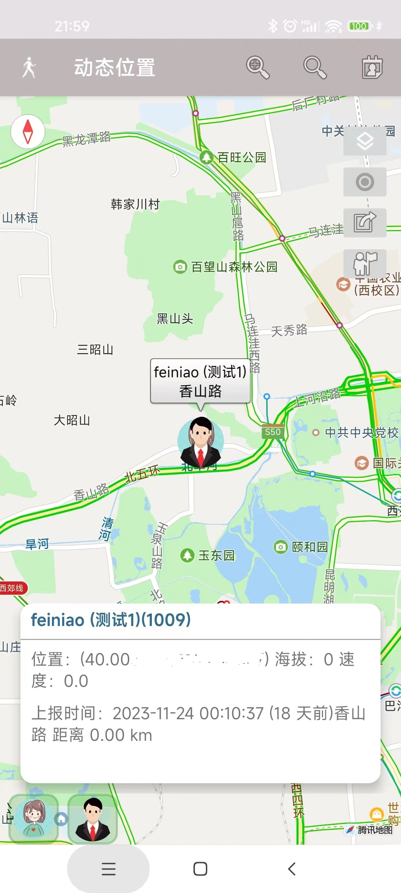

# travalbook （行迹）
## **一、用途**

最初想做这个是2022年夏天，我家优优要参加夏令营，希望能实时看到他在什么位置，可是这么简单的功能手机竟然没有内置。当时是自己架设了开源的OpenGTS服务器（https://blog.csdn.net/robinfoxnan/article/details/125782607），手机端配置了gpsLogger上传信息，能实现轨迹查看了。但是并不方便，主要是网页使用开源地图，比较慢，而且没有手机端可以查看。

后来，陆续使用国内的一些软件，包括足迹、守护家人等，总有这样那样的不满意。之后也测试了国外开源的聊天软件 tinode，也是有各种设计上的问题，所以最终决定还是自己做一个。

## 二、场景

去年，之前一个爱好徒步的同事出事了，搜救了好久才找到，在朋友圈看到噩耗的时候已经过去好多天了。之后的新闻中也时不时有各种人员失踪的新闻。

如果我们的手机或者APP能实时在家人与朋友间查看位置信息，很多问题解决起来也许会更加容易。

场景1：查看老人、孩子等家人的位置；

场景2：徒步或者团建等户外活动，相互查看位置，类似单兵作战辅助工具；

场景3：旅游、徒步轨迹分享；

## **三、功能定义**

travalbook 是一款安卓开源APP。是个人或者小公司内部匿名的社交软件，可以用记录与分享个人位置轨迹的APP，用于家人与朋友之间查看相互位置。同时为徒步爱好者提供一些有用的功能。

阶段一：实现基本的用户管理与位置信息共享；

阶段二：实现基于地图的精确标注等户外场景功能。

阶段三：实现社区功能；【TODO】

阶段四：实现基本的聊天；【TODO】

## 四、当前版本【2023-12-12】

目前基本实现了

阶段一：

1）注册，登录，好友查找，添加关注与取消，设置地图显示好友位置；个人信息设置，头像与昵称；

2）多种场景的信号采集周期，与参数设置；

阶段二：

1）轨迹的录制与保存；

2）地点的收藏与标注；

## 五、使用方法

### 5.1 注册与登录

首次使用需要注册，当用户名一栏填写字母或者汉字，下面填写密码，则使用此用户名和密码注册一个账号，注册成功后返回的账号为数字。之后就可以使用数字账号登录了。

之后打开会自动登录。

### 5.2 主界面说明

登录以后进入的界面就是地图界面，如下：

其中，功能区分为几个：
1）最底部是自己与显示位置的好友的图标，点击时候地图会自动切换位置；
2）图标上侧是经纬度坐标的详细信息的信息栏；
3）窗口顶部右侧按钮分别是：缩放和隐藏信息栏；
4）右侧的图标按钮分别是：图层切换，记录当前轨迹，分享轨迹，导入轨迹。

点击好友的图标，镜头会切换到好友的位置，效果如下：

### 5.3更改个人信息（可选）

主要是更改头像与昵称，其他的不重要，以后有社区了才有用。目前头像是内置了35个图片，不支持上传自定义。

### 5.4 搜索好友

好友目前仅仅支持号码搜索，当关注对方时候，默认也是等于向对方开放了自己的位置查看权限，
当双方互相关注对方的时候，可以相互查看位置信息；
不需要实时查看的不必一定开启在地图上展示；

将"关注"开关打开，即为设置了关注对方；同时也等于向对方开放了自己的位置查看权限；

### 5.5 设置运动模式的信息采集周期

这个功能主要是为了在“电池的消耗”与“采集位置信息的频率”之间达到一个平衡而设置的，
下图是默认的参数：

### 5.6  运动模式切换
在界面顶部点击不同的图标，就可以设置不同的运动模式，默认是徒步模式30秒采集一次GPS信号，
如果希望长时间使用，又需要低功耗运行，那么建议使用节能模式，5分钟上报一次位置即可。

这里的的”开始“按钮与地图界面右侧的录制按钮功能相同；

### 5.7 轨迹管理

轨迹界面主要是用于管理录制的各种轨迹，显示基本信息；如果需要在地图上显示轨迹，需要在轨迹的小星星上点一下即可。会到地图界面就会看到加载的轨迹；

### 5.8 收藏地点管理

重要的地点可以通过在地图上长按的方式来添加，并且可以再次拖动，

再次点击地图上“标记点”的图标，会弹出浮动菜单，编辑信息或者删除。

编辑信息界面可以对点添加名称以及备注信息，添加后会保存到收藏夹。

### 5.9 权限说明

1） 定位权限：请设置为“一直允许”，否则后台运行无法获取定位；

2）本地存储读写权限：请设置为“一直允许”，否则记录轨迹数据会出错；

3）电源优化选项：请设置为节能方式 “不限制”，否则后台运行时，无法获取定位；

4）传感器权限：可选。

## 后记

这款软件并没有打算如同其他的位置分享软件一样添加广告或者让用户购买会员，因为广告十分影响使用体验：当打开一个软件时如果需要要等好久的广告才能使用，那么真的让人很心烦。同时我也比较讨厌会员机制。

我开源的这个软件，它并没有很复杂或者高深的技术，只是希望它在我自己用同时，也对大家有用。

我架设了一个测试服务器。账号本身是匿名登录，如果对自己的行程隐私十分在意朋友也可以自己架设服务器。

如果您觉得这个软件对您有帮助，或者您觉得这个软件有用，那么可以请我喝杯咖啡，那么将是对我最大的支持和鼓励，谢谢。

